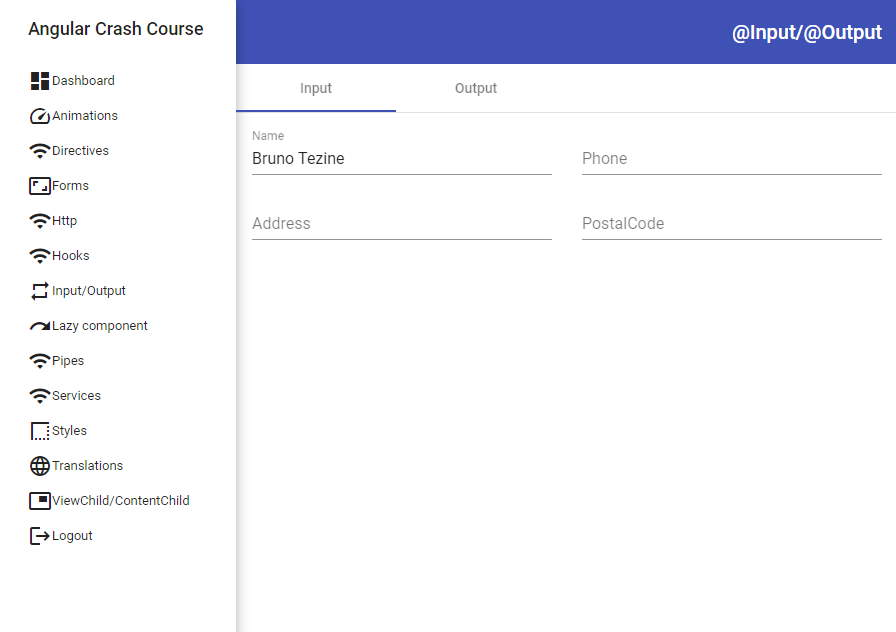

# ANGULAR CRASH COURSE

<!--toc generated automatically by running markdown-toc -i Angular.md-->

<!-- toc -->

- [ANGULAR](#angular)
- [POC](#poc)
- [Project Structure](#project-structure)
- [Modules](#modules)
- [Components](#components)
  * [File structrure](#file-structrure)
  * [Lifecycle](#lifecycle)
  * [Input properties/parameters](#input-propertiesparameters)
  * [Output events](#output-events)
  * [ViewChild](#viewchild)
  * [ContentChild](#contentchild)
  * [Hooks](#hooks)
  * [Animations](#animations)
- [Forms](#forms)
  * [Template-driven forms](#template-driven-forms)
  * [Reactive forms](#reactive-forms)
- [Services](#services)
- [Pipes](#pipes)
- [Directives](#directives)
  * [Attribute Directives](#attribute-directives)
  * [Structural Directives](#structural-directives)
- [HttpClient](#httpclient)
- [Router](#router)
- [Angular Elements](#angular-elements)
- [Internationalization](#internationalization)
- [Server Side Rendering](#server-side-rendering)
- [PWA](#pwa)
- [Angular Workspace (App + one Lib)](#angular-workspace-app--one-lib)
- [Tests](#tests)
- [Deployment](#deployment)
- [Open API Integration](#open-api-integration)
- [CORS](#cors)

<!-- tocstop -->

* [Angular](https://angular.io/) is progressive, reactive typescript web framework that allows the creation of Single Page applications. The project is sponsored by Google and mostly used by enterprise level websites with complex and lots of pages and code files. It provides Behavior Driven Testing (BDD) out of the box, Router, Internationalization, Ahead of Time compiling, Server Side Rendering, Dependency injection, Animations, ...., and its own http client. 
* Angular provides its own [Command Line Interface (CLI)](https://cli.angular.io/) from where you can easily create applications, libraries and others. Angular also has support for centralized workspaces, where each [workspace](https://angular.io/guide/file-structure) may contain several Angular projects. "The top level of the workspace contains workspace-wide configuration files, configuration files for the root-level application, and subfolders for the root-level application source and test files."
* Applications can be easily updated to the newest version by following the procedure described [here](https://update.angular.io/) and there's an official material design components built in Angular. More info [here](https://material.angular.io/). 
* Angular has a built-in support for [Web Component](https://developer.mozilla.org/en-US/docs/Web/Web_Components) standard. By using a web component, it's possible to export Angular Components to be used outside Angular projects, so you may use them in a React, Vuejs, or any other Web framework. "Custom elements bootstrap themselves - they start automatically when they are added to the DOM, and are automatically destroyed when removed from the DOM". A more detailed information on how to create Web Components [here](https://angular.io/guide/elements).
* There are many enterprise level websites running Angular. You can check its showcase [here](https://www.madewithangular.com/)

# POC

* There's a Proof of Concept project following this material. You can find the code [here](./POC). The purpose of the POC is to exemplify all subjects mentioned in this document. It's composed by an Angular workspace with 1 application (core-project), 1 Angular library (users-lib), 1 Angular module (extra) ...
* It uses Material Design components, bootstrap css, internationalization, animations, services, lazy loading, template and reactive forms and many other features. 




# Workspace File Structure

* It is recommended to create a workspace whenever you want to start a new application from scratch. There's a detailed description on Angular website [here](https://angular.io/guide/file-structure) and a great tutorial provided by the community [here](https://www.tektutorialshub.com/angular/angular-folder-structure-best-practices/).
* Explaining the basics, we usually have a single application inside the workspace and several libraries and modules. Components, Pipes, Directives, Services can be added into any of these 3. All files can ben created by using `ng` command line interface. Usually, each Angular component creates 3 files (html, ts, and spec.ts). The `spec.ts` is a [Jasmine](https://jasmine.github.io/) BDD file for testing purposes. If your editor  supports file nesting, there's no need to add each component into a new folder. There are many flags available that you can set while adding a new file using `ng`, and you may choose the best match for your goals. 
* It's highly recommended that you split your application into several modules. This way, you won't have a frontend monolith loaded from a single chunk file. The accompanying POC exemplify on how to create the file structures when using modules and libraries. 
* Here are some important files in the workspace: 
  * angular.json: It's the workspace configuration file. Here you'll find all projects that belong to the workspace and specific configurations for each one. 
  * package.json : Different of a standard package.json, this file configures the npm dependencies used by all projects inside the workspace. 
  * tsconfig.json: Similar to the package.json, this file is workspace wide. Whatever you define for your typescript configuration, it applies to all projects.  

# Modules and Libraries

In Angular, sometimes we get confused on when to create a library and when to create a Angular Module. Here are the basic differences between them: 

* [Module](https://angular.io/guide/architecture-modules): A Module resides inside the project and it's only used within it. We can add components and others into the module and load the module at runtime when needed. A common scenario is to do Lazy Loading triggered by a specific route in your website. Ex: /users load the Users module, containing all users components, services... . Unfortunately, this approach requires you to download the module source code in order to accomplish the lazy load, and that's why it's called as "mono repository/monorepo" approach. 
* [Library](https://angular.io/guide/libraries): A library is more appropriate when you wish to share it with several projects. This way, the application that uses the library doesn't have to access the library code, only the compiled bundle. It's even possible to do lazy loading of a library without having its source code, but it requires you to define a module wrapper into the consumer application. When working with complex projects, splitting codes into libraries is a good approach. This way, you are free from monorepo, so you don't need to download the entire workspace in order to modify something inside a specific library. 

## Libraries

[Angular libraries](https://angular.io/guide/creating-libraries) can only be used within Angular projects. If you intend to create a library to be used outside Angular, create a [Angular Element](https://angular.io/guide/elements). We can create a Angular library by executing the following command: 

```bash
ng new my-workspace --create-application=false # creates the an empty Angular workspace
cd my-workspace
ng generate library my-lib # creates the library project. 
```

Remember to define which components are exported by your library in your `my-lib.module.ts` and also in your `public_api.ts`. Components not explicitly exported cannot be imported and used in an Angular app. 

After finalizing the library code, you can build it like this:

```bash
ng build my-lib --prod
cd dist/my-lib
npm publish # This publishes into NPM repository. Please notice that Angular do not recommend to publish Ivy libraries to npm. 
```

If the library resides in a workspace, you can build it from the top level folder: `ng build --project my-lib`. The chunk file will be generated into the folder defined in your `ng-package.json` of your library. Notice that Angular Libraries have their own `package.json` and a file named `tsconfig.lib.json`, which does the same as `tsconfig.json`. You can than use `npm link` to debug your lib together with the main app. 

You can consume your library, by executing the following command in your app:

```bash
npm install my-lib --save
# now you can import its components, services... in your app module. 
```

### Lazy Loading Libraries

It's possible to do lazy loading of Angular libraries. To do so, follow the steps below:

1. Add your library as a dependency the `package.json` of your workspace or app. Ex:

```json
"dependencies": {
    "users-lib": "file:projects/users-lib",
},
```

2. Add the path into `tsconfig.json` of your workspace to make it easier to find your library path. Ex:

```json
"lib": [
    "es2018",
    "dom"
],
"paths": {
    "@myLib": [
        "dist/users-lib"
    ],
    "@myLib/*": [
        "dist/users-lib/*"
    ]
}
```

3. In case you wish to lazy load the library chunk according to a specific Angular Route, you can just add the following line into your `app-routing.module.ts`: 

```typescript
{path: 'users', loadChildren: () => import('@myLib').then(m => m.UsersModule)},
```

For more information, there's a community tutorial about lazy loading libraries [here](https://medium.com/@tomastrajan/why-and-how-to-lazy-load-angular-libraries-a3bf1489fe24) and a working sample inside the POC. 

## Modules

Angular Modules is the easiest way to do code splitting in your Angular application. Angular modules are not standard javascript modules. They provide some extra informations and they usually belong to a single Angular project. Normally, not used outside as a library. 

Angular Modules group components, services, directives, pipes and so on. Even when you create an application, Angular creates a "main" module for you, where by default all components/sevices... will be part of. As your app grows, it's a recommended that you split the app into several modules. This way, you can lazy load the chunk files by demand during runtime. It's really easy to accomplish this task in Angular. 

### Lazy Loading Modules

Follow the steps below to do lazy loading of modules in your Angular application. There's also a sample code inside the POC exemplifying this particular scenario. 

1. Create a module inside your Angular application

```bash
ng generate module CustomerDashboard
```

2. Restructure your project folder in a way that you have all components/services... inside the module folder. (There's an example in the POC).
3. Add some routing into the module, if you wish.
4. Now, just add the following line into your `app-routing.module.ts` : 

```typescript
{path: 'lazy-module', loadChildren:  async () => (await import('../src/extra-module/extra.module')).ExtraModule},
```

This will do the lazy loading of your module whenever the path 'lazy-module' is passed to the Angular Router. Different from loading a library, you MUST supply the source code of the module, or Angular display an error while compiling your app. That's why this is considered a "monorepo" approach. 

# Components

In Angular, every page or every widget is a considered a component. There's no difference between them. 

## File structrure

Different from [Vuejs](https://vuejs.org/) or [Svelte](https://svelte.dev/), Angular Components are usually splitted into 3 files: 

1. Html template file (.html)
2. Typescript file (.ts), where the component's logic resides. 
3. Stylesheet file (scss, css, stylus, less...). Stylesheets are scoped/isolated by default in Angular, so whatever you define in your component stylesheet is not spread over other components. 
4. Spec file. Spec files are [Jasmine](https://jasmine.github.io/) test files that are executed by [Karma](https://karma-runner.github.io/latest/index.html). 

It's also possible to have html/typescript/css into the same file, but it's not a common usage and discouraged by the community. 

## Lifecycle

* ngOnChanges(): fired whenever Angular sets or resets data-bound input properties
* ngOnInit(): fired once, after Angular display data-bound properties.
* ngDoCheck(): fired upon changes that cannot be detected by Angular on its own. 
* ngAfterContentInit(): fired once after what is passed to ng-content is rendered. 
* ngAfterContentChecked(): fired after what is passed to ng-content pass through the ngDoCheck 
* ngAfterViewInit(): fired once after the view and it's child views are rendered. 
* ngAfterViewChecked(): fired whenever Angular checks for the rendered view or its children. 
* ngOnDestroy(): fired just before Angular destroy the component. 

More about lifecycle hooks [here](https://angular.io/guide/lifecycle-hooks).

## Input properties/parameters

Angular provides the [@Input()](https://angular.io/api/core/Input) decorator to allow the component to receive input properties. Ex: 

```html
<!--App.component.html-->
<MyComponent title="Batman"></MyComponent>
```

```typescript
//MyComponent.component.ts
export class MyComponent {
  @Input() title:string='';
}
```

```html
<!--MyComponent.component.html-->
<div>
  Hello {{title}}    
</div>
<!--Displays Hello Batman --> 
```

## Output events

Similar to @Input, Angular provides the [@Output](https://angular.io/guide/inputs-outputs) decorator to fire events from the component. These events can be captured on the caller component. Ex:

```html
<!--App.component.html-->
<VInput (textChanged)="onTxtNameChanged($event)"></VInput>
```

```typescript
//App.component.ts
export class InputOutputComponent {
  onTxtNameChanged(txt:string){
    console.log('text entered in VInput:',txt)
  }
}
```

```typescript
//VInput.component.ts
export class VInputComponent {
  @Output() textChanged: EventEmitter<string> = new EventEmitter();

  onModelChanged(txt:string){
    this.textChanged.emit(txt);
  }
}
```


```html
<!--VInput.component.html-->
<input (ngModelChange)="onModelChanged($event)">
```

## DOM events

It's also possible to capture every DOM event inside a Angular Component. Ex:

```typescript 
export class VInputComponent {
  @HostListener('mouseenter') onMouseEnter() {
    console.log('mouse enter');
  }
}
//whenever the mouse enters into the component, the function "onMouseEnter" is fired.
```


## ViewChild

Whatever DOM element you insert into your Angular Component, is considered a [ViewChild](https://angular.io/api/core/ViewChild) and it's accessible from typescript after rendered. Ex:

```html
<!--App.component.html-->
<div #viewChildDiv>hello</div>
```

```typescript
export class AppComponent{
	@ViewChild('viewChildDiv') viewChildDiv?: ElementRef;
	
	ngAfterViewInit(): void {
    	if(this.viewChildDiv)this.viewChildDiv.nativeElement.style["backgroundColor"] = "orange";
    }
}
//Div color is changed to orange after rendered inside AppComponent
```

## ContentChild

Whatever you pass inside the DOM element is considered a ContentChild. The content passed can be rendered inside a `<ng-content>` tag. Ex:

```html
<!--app.component.html-->
<VHello>World!</VHello>
```

```html
<!--vhello.component.html-->
<p>Hello <ng-content></ng-content></p>

<!-- prints Hello World! -->
```

It's possible to have multiple `<ng-content>` and project content according to the type of content provided. This approach is also called "Multi-Slot Content Projection". You may find out more on how to achieve it [here](https://blog.angular-university.io/angular-ng-content/).

## Animations

Although it seems too complicated to create animations in html, Angular makes things easier. The framework provides it's own animation framework and it's quite powerful and well documented. You find the complete documentation [here](https://angular.io/guide/animations). 

The accompanying POC demonstrates a simple animation where we have a page requesting the user's email and password and a button. The components are displayed inside a div container with material elevation. Everything starts with `state='open'` . When user clicks the button, the state is changed to `closed` and the animation is triggered automatically. Follow the code below: 

```html
<!--animations.component.html-->
<div class="container p-3" [class.mat-elevation-z8]="true" [@openClose]="isOpen ? 'open' : 'closed'" >
    <div class="row">
        <VInput label="Email" class="col-md-12"></VInput>
    </div>
    <div class="row">
        <VInput label="Password" class="col-md-12"></VInput>
    </div>
    <button mat-raised-button color="primary" (click)="onBtnToggleClicked()" class="float-right">Animate</button>
</div>
```

```typescript
//animations.component.ts
@Component({
  selector: 'app-animations',
  templateUrl: './animations.component.html',
  styleUrls: ['./animations.component.scss'],
  animations: [
    trigger('openClose', [
      state('open', style({
        height: '200px',
        width: '400px',
        opacity: 1,
        backgroundColor: 'yellow'
      })),
      state('closed', style({
        height: '250px',
        width: '450px',
        opacity: 0.9,
        backgroundColor: '#00e676'
      })),
      transition('open => closed', [
        animate('1s')
      ]),
      transition('closed => open', [
        animate('0.5s')
      ]),
    ]),],
})
export class AnimationsComponent {
  isOpen = true;

  onBtnToggleClicked(){
    this.isOpen = !this.isOpen;
  }
}
```

What happens above is that when user clicks the `Animate` button, `onBtnToggleClicked` is called and the state changes to `closed`. The DOM element that will be animated is defined by the `[@openClose]` tag in the html and the corresponding trigger named `openClose` in the typescript. The animation above changes the `div` background color and increases the height/width a little. As you can see, it's not so complex! :-) 

# Forms

* Angular allow the creation of [web forms](https://angular.io/guide/forms-overview) in 2 different ways. It's up to you to which one you like best! 

## Template-driven forms

* [Template-drive forms](https://angular.io/guide/forms) binds its data directly to variables and you you can think as "do yourself" approach, since you have to validate, display errors, and others manually. Despite of that, template-drive is straight forward. It's easy to understand and code. You can find a sample code in the POC, which is similar to the code below: 

```html
 <form  (ngSubmit)="onTemplateDrivenFormSubmit()" >
     <div class="row">
         <mat-form-field class="col-md-6">
             <mat-label>First name</mat-label>
             <input matInput [(ngModel)]="firstName" id="txtFirstName" name="txtFirstName" required minlength="4">
         </mat-form-field>
         <mat-form-field class="col-md-6">
             <mat-label>E-mail</mat-label>
             <input matInput [(ngModel)]="email" id="txtEmail" name="txtEmail" required email>
             <mat-hint>Errors appear instantly!</mat-hint>
         </mat-form-field>
     </div>
     <div class="row p-3">
         <button mat-raised-button color="primary" class="float-right" type="submit">Submit form</button>
     </div>
</form>
```

```typescript
export class FormsComponent {
  firstName='';
  email='';

  onTemplateDrivenFormSubmit(){
    console.log('Template driven form values:', this.firstName, this.email);
  }
}
```

Basically, in the code above we have a form with 2 text-fields and a button. Whenever something changes in text-fields, Angular automatically updates the corresponding variable (`firstName or email`). This is done through [ngModel](https://angular.io/api/forms/NgModel), which binds the controls to the variable. The form itself fires the `onTemplateDrivenFormSubmit` when the button (marked as type=submit) is clicked. Plain simple! 

## Reactive forms

* 

# Services

[Services](https://angular.io/guide/architecture-services) are used as `Singletons` that are injected into a Angular Component or other Service when needed. Prior to Angular 6, services had to be declared as a provider explicitly in the module, but now we only need to specify in which Angular module the Service will be injected. Follow sample usage to retrieve a list of employees from a Restful Server:

```typescript 
//employees.service.ts
@Injectable({
  providedIn: 'root' //this indicates that this service is injected into the Angular root module of your project
})
export class EmployeesService {

  constructor(private httpClient:HttpClient) { }//httpClient is also a service injected here. :-) 

  public async getEmployees(): Promise<Employee[]>{
  let result=await this.httpClient.get<Employee[]>('http://dummy.restapiexample.com/api/v1/employees').toPromise();
  return result.data;
  }
}
```

```typescript
//app.component.ts
export class AppComponent implements OnInit {
  employees?:Employee[];
    
  constructor(private employeesService:EmployeesService) {//service singleton injected here      
  }

  async ngOnInit() {
    this.employees= await this.employeesService.getEmployees();
   }
}
```


# Pipes

* ddkdh

# Directives

* dkdhd

## Attribute Directives

* sddd
* Mais info [aqui](https://angular.io/guide/attribute-directives)

## Structural Directives

* 

# Router

* Avoid using named router-outlet. Instead, prefer using several \<router-outlet> with child routes. Ex: 

1. Let's suppose you have a main angular project. 

2. There's a \<router-outlet> in the app.component.html

3. Than, after the user login, you display a Home.component. 

4. In this HomeComponent, you have another \<router-outlet> 

5. When user clicks on a button, you want to load another module into the router-outlet inside the HomeComponent. 

6. To do so, create the following routes in your main project: 

```typescript
const routes: Routes = [
    {path: '', redirectTo: 'login', pathMatch: 'full'},
    {path: 'login', component: LoginComponent},
    {path: 'home', component: HomeComponent, children:[
        //this is a child route, because we have a <router-outlet> inside HomeComponent
        {path: 'cadastros', loadChildren: () => 	 import('../../cadastros/src/lib/cadastros.module').then(m => m.CadastrosModule)},
    ]
    },
    // {path: '**', component:LoginComponent},
];
```

8. Now, under Cadastros module, add the followint routes:

```typescript
const routes: Routes = [
    {path: '', component: CadastrosComponent, children: [//route: /cadastros
    {path: 'clients', component: ClientsComponent,},
    {path: 'clients/edit', component: ClientsEditComponent},//this cannot be a child route of clients, since we don't have a router-outlet inside clients
]}];
```

10. Now, you can load the Cadastros module from HomeComponent, by adding the code: 

```typescript
await this.router.navigate(['home/cadastros/clientes']);
```

12. This will do the lazy loading of the Cadastros module and display the ClientsComponent inside the router-outlet in HomeComponent.

# HttpClient

* ddff

# Angular Elements

* dkdhd

# Internationalization

* More info about translations [here](https://angular.io/guide/i18n)
* There's also a great tool for translations called NGX-Translate. More info [here](http://www.ngx-translate.com/).

# Server Side Rendering

* 

# PWA

* 

# Angular Workspace (App + one Lib)

* Segue um passo a passo para criar um workspace Angular contendo um app e uma lib abaixo: 
1. Baixar o Angular CLI [aqui](https://cli.angular.io/)
1. Executar `ng new nomeworkspace --createApplication="false"` . Há informações sobre os parâmetros do ng new [aqui](https://angular.io/cli/new)
1. `cd nomeworkspace`
1. Criar um projeto para a aplicação: `ng generate application nome-app --routing=true --style=scss`
1. Criar um projeto para a lib: `ng generate library nome-lib`
1. Instalar os pacotes npm: `npm install`
1. Executar a aplicação: `ng serve`

* 


# Tests
* Mais informações [aqui](https://angular.io/guide/testing)

* Os testes unitários são realizados através de Karma e Jasmine. 

* Jasmine é o framework mais popular para testes no Angular. 

* Karma é uma ferramenta criada pelo time de Angular para rodar testes unitários. Ele carrega o browser, lê os testes a partir de um arquivo config, executa e apresenta o resultado em um terminal. 

* Protractor (opcional) é um framework de teste end-to-end. Ele executa o teste no browser da mesma maneira que um usuário executaria. Assim, ele faz o teste de UI. O Protractor se baseia no WebdriverJS e Selenium, assim, deve-se estar familiarizado com essas ferramentas para usa-lo.

* O formato dos testes é especificado pelo [Jasmine](https://jasmine.github.io/)

* Os testes de cada componente são escritos no arquivo .spec.ts. 

* Para iniciar os testes, basta digitar `ng test`. Será aberto o Chrome e vai ser apresentado o resultado de todos os testes executados. O resultado também é apresentado no console. 

* Ao modificar um componente e salvar, será executado o teste novamente. 

* As configurações dos testes ficam em karma.conf.js e test.ts na pasta src. 

* Services também podem ser testados. 

* Segue um exemplo de teste unitário para a tela de login abaixo:

  ```typescript
  //Login.component.ts
  export class LoginComponent implements OnInit {
  
    email?:string;
    password?:string;
    errorMsg?:string;
    @ViewChild('errorDiv') errorDiv?: HTMLDivElement; //div must be like <div #errorDiv></div>
  
    constructor(protected router: Router, private usersService:UsersService) { }
  
    ngOnInit(): void {}
  
    async onBtnLoginClicked():Promise<void>{
      if(!await this.authenticateUser()) return;
      else await this.router.navigate([Defines.routeUsers]);
    }
  
    async authenticateUser():Promise<boolean>{
      this.errorMsg=undefined;
      let ok=await this.usersService.authenticate(this.email,this.password);
      if(ok)return true;;
      this.errorMsg = 'Email ou senha inválidos';
      return false;
    }
  }
  ```

  ```typescript
  //login.component.spec.ts
  describe('LoginComponent', () => {
    let component: LoginComponent;
    let fixture: ComponentFixture<LoginComponent>;
  
    beforeEach(async(() => {
      TestBed.configureTestingModule({
        declarations: [ LoginComponent ],
        imports: [RouterTestingModule, HttpClientModule],
        providers:[UsersService]
      })
      .compileComponents();
    }));
  
    beforeEach(() => {
      fixture = TestBed.createComponent(LoginComponent);
      fixture.debugElement.nativeElement.style.visibility = "hidden";//use this to hide the component from karma result
      component = fixture.componentInstance;
      fixture.detectChanges();
    });
  
    // it('Criação do componente', () => {
    //   expect(component).toBeTruthy();
    // });
  
    it('Teste com email/senha inválidos', async () => {
      component.email=undefined;
      component.password=undefined;
      let result=await component.authenticateUser();
      expect(result).toBeFalse();
      //let's wait for dom updates and check if the error div is displayed.
      fixture.detectChanges();
      let errorDiv = fixture.debugElement.query(By.css('#errorDiv')); //div must be like <div id="errorDiv"></div>
      //expect(component.errorDiv).toBeTruthy()
      //ou
      expect(errorDiv).toBeTruthy()
    });
  
    it('Teste com email/senha válidos', async () => {
      component.email='bruno@tezine.com';
      component.password='tata';
      let result=await component.authenticateUser();
      expect(result).toBeTrue()
    });
  });
  ```


# Deployment

* dd


# Open API Integration

* In order to generate the REST APIs automatically for  your Angular project using [Open API Generator](https://openapi-generator.tech/), take a look at the Open API Genrator [here](../../OpenAPIGenerator.md).

12. 

# CORS

In order to enable CORS in your Angular application to allow http requests to other domains/ports, add a file named `proxy.conf.json` as below in your root folder:

```json 
{
    "/api/*": {
        "target": "http://mydomain.com:9090",
        "secure": false,
        "logLevel": "debug"
    }
}
```

Now, just add the line `proxyConfig` in your `angular.json` inside `serve` as showed below:

```json
"serve": {
          "builder": "@angular-devkit/build-angular:dev-server",
          "options": {
            "browserTarget": "meuprojeto:build",
            "proxyConfig": "src/proxy.conf.json"
          },
```

That's it! Now your Angular application is ready to forward API requests to a microservice hosted at http://mydomain.com:9090

# Security

# Typescript properties

Every Angular workspace has a `tsconfig.json` file. All typescript configurations used by the projects in the workspace are written in it. There are a few [compiler options](https://www.typescriptlang.org/docs/handbook/compiler-options.html) that are very important and are described below:

1. strict: Strict is an important option that is disabled by default, but it's highly recommended to enable it. Basically, when disabled, you can write typescript as pure javascript (non typed). If you enable it, the compiler will display an error whenever you try to create a property that should never be null (without `?` at the end. Ex: `title:string` ). It'll display an error when you don't specify function parameter types, and many other options. There's a good explanation about `strict` [here](https://medium.com/webhint/going-strict-with-typescript-be3f3f7e3295).
2. removeComments: I have no idea why, but this flag is disabled by default, so it's important to enable it in order to remove your code comments for the production build. 

# Advanced Scenarios

## Component Lazy Loading

* One of the cool features that Ivy brougth to Angular in version 9, was the ability to do Lazy Loading for Angular Components. 

* There are several tutorials explaining on how to make it work in several ways. Check it out [here](https://indepth.dev/lazy-loading-angular-modules-with-ivy/) and [here](https://netbasal.com/welcome-to-the-ivy-league-lazy-loading-components-in-angular-v9-e76f0ee2854a). 

  
